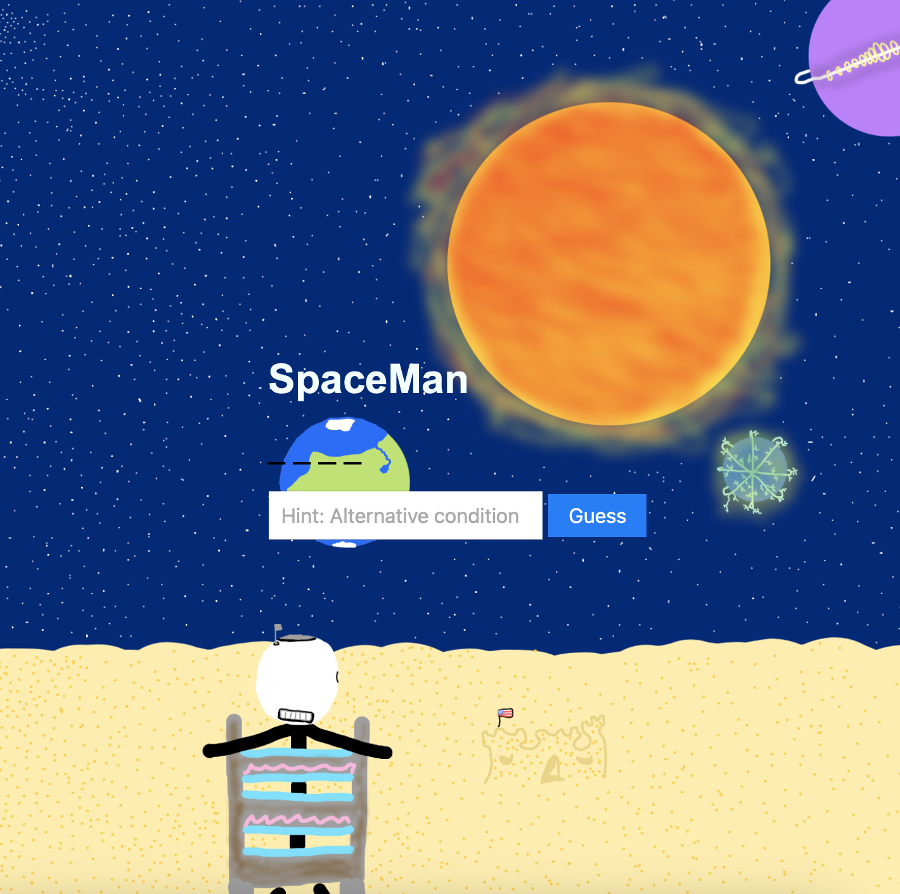
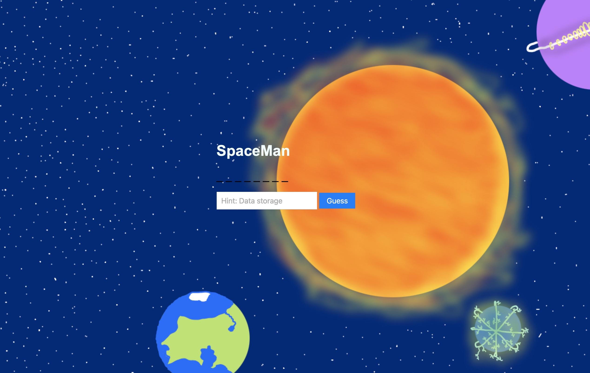

# Spaceman

_Players are presented with a secret word relating to code, with a hint for the word (because this is a project for a coding bootcamp). Each letter is represented by blank spaces. Five incorrect guesses, and the Spaceman dies. Do you have what it takes to save the Spaceman?_

## Screenshots

(_*View not fullscreen*_)

(_*View Fullscreen*_)

## Technologies Used

_HTML,
CSS, &
Javascript_

## Getting Started

<!-- insert link for game here -->

## Next Steps:
_Adding an actual "Spaceman" that has minor animations based on right or wrong guesses. Adding sounds, based on right or wrong guesses. Also I want to make my textbox/button and letter guess stationary!_